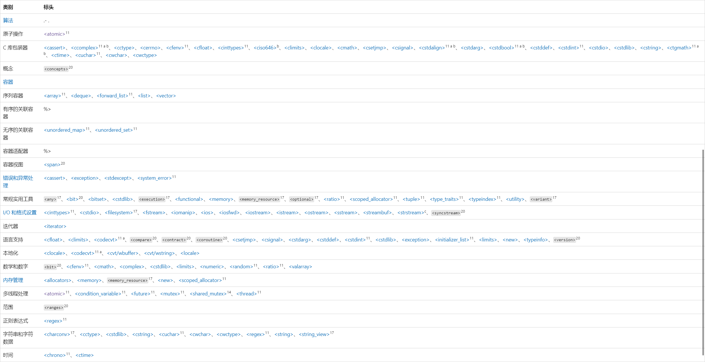

# C++ 标准库(STL) 学习笔记

完整的标准库，按类别划分：



[C++ 标准库头文件 | Microsoft Learn](https://learn.microsoft.com/zh-cn/cpp/standard-library/cpp-standard-library-header-files?view=msvc-170#headers-by-category)

[C++ 标准库 | 菜鸟教程](https://www.runoob.com/cplusplus/cpp-standard-library.html)

部分主要组件：

- [输入输出](#输入输出)
  - `<iostream>`: [标准输入输出流](#iostream)
  - `<fstream>`: [文件输入输出流](#fstream)
  - `<sstream>`: [字符串流](#sstream)
  - `<iomanip>`: [输入输出流格式化](#iomanip)

- [容器](#容器)
  - `<array>`: [定长数组容器](#array)
  - `<vector>`: [动态数组容器](#vector)
  - `<deque>`: [双端队列容器](#deque)
  - `<list>`: [双向链表容器](#list)
  - `<forward_list>`: [单向链表容器](#forward_list)
  - `<stack>`: [栈容器适配器](#stack)
  - `<queue>`: [队列容器适配器](#queue)
  - `<priority_queue>`: [优先队列容器适配器](#priority_queue)
  - `<set>`: [集合容器（基于平衡二叉树）](#set)
  - `<unordered_set>`: [无序集合容器（基于哈希表）](#unordered_set)
  - `<map>`: [映射容器（键值对，基于平衡二叉树）](#map)
  - `<unordered_map>`: [无序映射容器（基于哈希表）](#unordered_map)
  - `<bitset>`: [二进制位容器](#bitset)

- [算法和迭代器](#算法和迭代器)
  - `<algorithm>`: [常用算法（如排序、查找等）](#algorithm)
  - `<iterator>`: [迭代器](#iterator)

- [函数对象和绑定](#函数对象和绑定)
  - `<functional>`: [定义函数对象及相关工具](#functional)

- [数学和数值运算](#数学和数值运算)
  - `<numeric>`: [数值操作（如累计、乘积等）](#numeric)
  - `<complex>`: [复数运算](#complex)
  - `<valarray>`: [数组类及相关操作](#valarray)
  - `<cmath>`: [数学函数](#cmath)

- [字符串和正则表达式](#字符串和正则表达式)
  - `<string>`: [标准字符串类](#string)
  - `<regex>`: [正则表达式](#regex)

- [时间和日期](#时间和日期)
  - `<ctime>`: [时间处理](#ctime)
  - `<chrono>`: [时间库](#chrono)

- [多线程和并发](#多线程和并发)
  - `<thread>`: [多线程支持](#thread)
  - `<mutex>`: [互斥量](#mutex)
  - `<condition_variable>`: [条件变量](#condition_variable)
  - `<future>`: [异步编程支持](#future)
  - `<atomic>`: [原子操作](#atomic)

- [内存管理](#内存管理)
  - `<memory>`: [智能指针及动态内存管理](#memory)
  - `<new>`: [动态内存分配](#new)

- [类型特性和运行时类型识别](#类型特性和运行时类型识别)
  - `<type_traits>`: [类型特性](#type_traits)
  - `<typeinfo>`: [运行时类型识别](#typeinfo)

- [异常处理](#异常处理)
  - `<exception>`: [异常处理基类及相关工具](#exception)
  - `<stdexcept>`: [常用异常类（如 std::runtime_error 等）](#stdexcept)

- [输入输出操作](#输入输出操作)
  - `<cstdio>`: [C 风格输入输出](#cstdio)
  - `<cstdint>`: [定长整数类型](#cstdint)

- [其他工具](#其他工具)
  - `<utility>`: [通用工具（如 std::pair 和 std::move 等）](#utility)
  - `<random>`: [随机数生成](#random)
  - `<locale>`: [本地化支持](#locale)
  - `<codecvt>`: [字符编码转换](#codecvt)
  - `<cassert>`: [断言](#cassert)
  - `<cctype>`: [字符处理](#cctype)
  - `<cstring>`: [字符串处理](#cstring)
  - `<cwchar>`: [宽字符处理](#cwchar)
  - `<climits>`: [数值极限](#climits)
  - `<cfloat>`: [浮点极限](#cfloat)
  - `<cstdlib>`: [常用工具（如 std::rand 和 std::abs 等）](#cstdlib)

## 输入输出

### iostream

比较熟悉，不多赘述。只写新发现的东西。

- `istream`、`ostream`、`iostream`本质都是抽象基类。
- `cin`、`cout`、`cerr`、`clog`本质都是对象。
- `>>`、`<<`是操作符。

可用`fail()`方法检验输入输出流操作是否成功，用法：

```C++
cin >> num;
if(cin.fail()){cerr << "cin error!" << endl;}
```

可用`getline()`方法获取带空格的一行输入，用法：

```C++
string aline;
getline(cin, aline);
```

### fstream

见[文件读写](note.md/#文件和流)

### sstream

处理字符串和数字之间的转换。

有3个输入、输出流类：

1. `istringstream`：用于从字符串中读取数据。
2. `ostringstream`：用于将数据写入字符串。
3. `stringstream`：是`istringstream`和`ostringstream`的组合，可以同时进行读取和写入操作。

**用法**：

从字符串读取数字：

```C++
istringstream iss(str);// 存入到流
iss >> i >> f;// 取出到变量
```

保存数字到字符串：

```C++
oss << i << " " << f; // 存入到流
string str = oss.str() //取出到字符串
```

其他操作：

- 清空流：`ss.str("");`

### iomanip

格式化输入\输出流。将算子用 << 和 cout 连用起效。例如：

```C++
cout << hex << 12 << "," << 24;
```

| 名称          | 描述                                       |
| ------------- | ------------------------------------------ |
| get_money     | 获取货币金额(可选择采用国际格式)。         |
| get_time      | 使用指定格式以某种时间结构获取时间。       |
| put_money     | 提供货币金额(可选择采用国际格式)。         |
| put_time      | 采用要使用的时间结构和格式字符串提供时间。 |
| quoted        | 使用插入和提取运算符实现字符串的方便往返。 |
| resetiosflags | 清除指定标志。                             |
| setbase       | 为整数设置基数。                           |
| setfill       | 设置用于在右对齐显示中填充空格的字符。     |
| setiosflags   | 设置指定标志。                             |
| setprecision  | 为浮点值设置精度。                         |
| setw          | 指定显示字段的宽度。                       |

[iomanip | Microsoft Learn](https://learn.microsoft.com/zh-cn/cpp/standard-library/iomanip?view=msvc-170#manipulators)

上面的可能有些不全。另一份：

表1：**C++ 流操纵算子**

| 流操纵算子          | 作  用                                                                        |
| ------------------- | ----------------------------------------------------------------------------- |
| *dec                | 以十进制形式输出整数                                                          |
| hex                 | 以十六进制形式输出整数                                                        |
| oct                 | 以八进制形式输出整数                                                          |
| fixed               | 以普通小数形式输出浮点数                                                      |
| scientific          | 以科学计数法形式输出浮点数                                                    |
| left                | 左对齐，即在宽度不足时将填充字符添加到右边                                    |
| *right              | 右对齐，即在宽度不足时将填充字符添加到左边                                    |
| setbase(b)          | 设置输出整数时的进制，b=8、10 或 16                                           |
| setw(w)             | 指定输出宽度为 w 个字符，或输人字符串时读入 w 个字符                          |
| setfill(c)          | 在指定输出宽度的情况下，输出的宽度不足时用字符 c 填充（默认情况是用空格填充） |
| setprecision(n)     | 设置输出浮点数的精度为 n。                                                    |
| setiosflags(flag)   | 将某个输出格式标志置为 1                                                      |
| resetiosflags(flag) | 将某个输出格式标志置为 0                                                      |
| boolapha            | 把 true 和 false 输出为字符串                                                 |
| *noboolalpha        | 把 true 和 false 输出为 0、1                                                  |
| showbase            | 输出表示数值的进制的前缀                                                      |
| *noshowbase         | 不输出表示数值的进制.的前缀                                                   |
| showpoint           | 总是输出小数点                                                                |
| *noshowpoint        | 只有当小数部分存在时才显示小数点                                              |
| showpos             | 在非负数值中显示 +                                                            |
| *noshowpos          | 在非负数值中不显示 +                                                          |
| *skipws             | 输入时跳过空白字符                                                            |
| noskipws            | 输入时不跳过空白字符                                                          |
| uppercase           | 十六进制数中使用 A~E。若输出前缀，则前缀输出 0X，科学计数法中输出 E           |
| *nouppercase        | 十六进制数中使用 a~e。若输出前缀，则前缀输出 0x，科学计数法中输出 e。         |
| internal            | 数值的符号（正负号）在指定宽度内左对齐，数值右对 齐，中间由填充字符填充。     |

表2：**setiosflags() 可以使用的标志及其说明**

| 标 志           | 作 用                                                         |
| --------------- | ------------------------------------------------------------- |
| ios::left       | 输出数据在本域宽范围内向左对齐                                |
| ios::right      | 输出数据在本域宽范围内向右对齐                                |
| ios::internal   | 数值的符号位在域宽内左对齐，数值右对齐，中间由填充字符填充    |
| ios::dec        | 设置整数的基数为 10                                           |
| ios::oct        | 设置整数的基数为 8                                            |
| ios::hex        | 设置整数的基数为 16                                           |
| ios::showbase   | 强制输出整数的基数（八进制数以 0 开头，十六进制数以 0x 打头） |
| ios::showpoint  | 强制输出浮点数的小点和尾数 0                                  |
| ios::uppercase  | 在以科学记数法格式 E 和以十六进制输出字母时以大写表示         |
| ios::showpos    | 对正数显示“+”号                                               |
| ios::scientific | 浮点数以科学记数法格式输出                                    |
| ios::fixed      | 浮点数以定点格式（小数形式）输出                              |
| ios::unitbuf    | 每次输出之后刷新所有的流                                      |
| ios::stdio      | 每次输出之后清除 stdout, stderr                               |

[C++ cout格式化输出（输出格式）完全攻略- 图神经网络](https://www.cnblogs.com/BlairGrowing/p/12810917.html)

## 容器

容器类型上的操作形成了一种层次：

1. 某些操作是所有容器类型都提供的
2. 另外一些操作仅针对顺序容器、关联容器、无序容器
3. 还有一些操作只针对于小部分容器

所有容器：

| 关键字                            | 含义                                       |
| --------------------------------- | ------------------------------------------ |
| **类型别名**                      |                                            |
| `iterator`                        | 此容器的迭代器类型                         |
| `size_type`                       | 最大可能容器大小                           |
| `value_type`                      | 元素类型                                   |
| **swap、大小**                    |                                            |
| `swap()`                          | 交换元素                                   |
| `empty()`                         | 判断是否为空                               |
| `size()`                          | 返回元素个数                               |
| **添加、删除元素(不适用于array)** |                                            |
| `insert()`                        | 在指定位置插入元素                         |
| `erase()`                         | 删除元素                                   |
| `clear()`                         | 清空容器                                   |
| **获取迭代器**                    |                                            |
| `begin()`                         | 返回指向第一个元素的迭代器                 |
| `end()`                           | 返回指向最后一个元素之后的位置的迭代器     |
| **反向容器的额外成员**            |                                            |
| `reverse_iterator`                | 反向迭代器类型                             |
| `rbegin()`                        | 返回指向第一个元素的反向迭代器             |
| `rend()`                          | 返回指向最后一个元素之后的位置的反向迭代器 |

### 容器的选择

通常，使用`vector`容器是最好的选择，除非有很好的理由选择其他容器。

- `vector`在尾部插入数据很快，在其他位置插入数据可能很慢。
- 如果程序中有很多小的元素，且不想有额外的空间开销，则**不应该**选用`list`、`forward_list`。
- 如果有随机访问的需求，选择`vector`或`deque`。
- 如果经常在中间位置插入或删除元素，选择`list`或`forward_list`。
- 如果大部分情况是在头尾增删改查，选择`deque`。

- 如果插入时可能在中间，使用时只在头尾(数值顺序访问)。可以在输入阶段用`list`，然后`sort`，拷贝到`vector`，再使用。

### array

是一种固定大小的**数组**容器。

与数组相比，它：

1. 强制类型检查。不能往空间里随便填东西了。
2. 数组大小在编译时确定。不会有莫名其妙的越界了。
3. 内存连续(这个两者都有吧？)
4. 作为标志容器，有与`vector`相似的性质(定义方式、遍历方式、取size()等)。

适用于需要固定大小数组的场合。

### vector

用的挺多了，不加赘述。碰到问题访问：  
[vector 类 | Microsoft Learn](https://learn.microsoft.com/zh-cn/cpp/standard-library/vector-class?view=msvc-170#functions)

### deque

双端队列。

成员介绍：  
[deque 类 | Microsoft Learn](https://learn.microsoft.com/zh-cn/cpp/standard-library/deque-class?view=msvc-170#members)

**主要成员摘要**：

类定义：

```C++
template <class Type, class Allocator =allocator<Type>>
class deque
```

TODO:...


### list

序列容器。类似于链表，允许在任意位置快速访问；不需要设定大小，不需要重新分配内存。

大部分操作与`vector`相同，但因为其类似于双向链表的性质，它不支持随机访问，可通过**双向迭代器**进行遍历元素。

### forward_list

单向链表，其他与`list`并无不同。

### stack

栈。用法相似，不赘述。

### queue

队列数据结构。

不允许随机访问！

### priority_queue

优先队列。

默认是*最大堆*，即pop出的数据永远是最大的一个。可以手动重载比较函数更改优先方式。

```C++
priority_queue<int> pq;

// 声明一个自定义类型的优先队列，需要提供比较函数
struct compare {
    bool operator()(int a, int b) {
        return a > b; // 这里定义了最小堆
    }
};
priority_queue<int, vector<int>, compare> pq_min;
```

同样，作为一种队列，它不能被随机访问，也不能通过迭代器访问。链表还是顺序结构取决于实现方式。

### set


