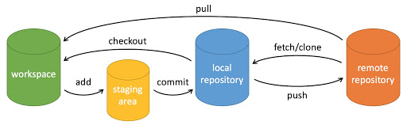

# All in Cpp Note

从类开始重学

--------

## Git

### 工作区、暂存区、版本库、远程仓库

```bash
# 工作区->暂存区：
git add filename

# 暂存区->版本库(本地)：
git commit -m "Commit message"

# 版本库->远程仓库：
git push origin branch-name

# 版本库(本地)<- 远程仓库
git pull origin branch-name
# 或者
git fetch origin branch-name
git merge origin/branch-name
```

### 基本操作



- `workspace`：工作区
- `staging area`：暂存区/缓存区
- `local repository`：版本库或本地仓库
- `remote repository`：远程仓库

## 内存分区模型

- 代码区：存放代码
- 全局区：**全局变量**、**静态变量**、**常量**
- 栈区：**函数参数**、**局部变量**。由编译器管理生命周期。
- 堆区：new出来的内存。由程序员管理生命周期

代码区和全局区存在于可执行文件中，堆栈在程序运行之后产生。

另：

- `const`修饰的全局变量视为常量(由其创建之后不可修改可印证)，放在全局区中。
- 由之前所学，得出一点注意事项：**不要返回局部变量地址**。  
  例如在函数中声明了一个局部变量并返回，可以正确返回，但函数结束之后，内存会被自动释放，指针变成野指针。  
  有意思的是：现代编译器会把这个局部变量做一次保留，被读取一次之后再释放。但这么做依然是不安全的。

## 引用

给变量起别名。很多情况能起到和指针一样的作用(操作特定一块内存)。

引用必须初始化，初始化之后不可再改变。

> 将字符串作函数参数时，如果不必创建待修改的副本，函数参数类型可写为`const &string`。  
> 其一，它避免了字符串拷贝。  
> 其二，它防止了字符串在函数中被修改。

拓展以上：  
引用能作为函数参数。此时类似于地址传递，但不能作指针偏移，修改值时不需要解引用。  
引用能作为函数返回值。返回之后不会像新创建的变量一样被销毁，但使用方式和变量一样。

引用的本质 ———— **指针常量**  
即：  
`int & ref` == `int* const ref`

## 时间&日期

C++主要用`tm`类型处理时间与日期。

```C++
struct tm {
  int tm_sec;   // 秒，正常范围从 0 到 59，但允许至 61
  int tm_min;   // 分，范围从 0 到 59
  int tm_hour;  // 小时，范围从 0 到 23
  int tm_mday;  // 一月中的第几天，范围从 1 到 31
  int tm_mon;   // 月，范围从 0 到 11
  int tm_year;  // 自 1900 年起的年数
  int tm_wday;  // 一周中的第几天，范围从 0 到 6，从星期日算起
  int tm_yday;  // 一年中的第几天，范围从 0 到 365，从 1 月 1 日算起
  int tm_isdst; // 夏令时
};
```

另有:

1. `time_t`：自 1970 年 1 月 1 日以来经过的秒数，获取失败返回-1。
2. `clock_t`：程序执行所使用的时间，获取失败返回-1。
3. `size_t`：不同平台用以格式化时间量的中间变量。需配合相关函数使用。

相关方法：

```C++
// 该函数返回系统的当前日历时间，自 1970 年 1 月 1 日以来经过的秒数。如果系统没有时间，则返回 -1。
time_t time(time_t *time);
// 该返回一个表示当地时间的字符串指针，字符串形式 day month year hours:minutes:seconds year\n\0。
char *ctime(const time_t *time);
// 该函数返回一个指向表示本地时间的 tm 结构的指针。
struct tm *localtime(const time_t *time);
// 该函数返回程序执行起（一般为程序的开头），处理器时钟所使用的时间。如果时间不可用，则返回 -1。
clock_t clock(void);
// 该函数返回一个指向字符串的指针，字符串包含了 time 所指向结构中存储的信息，返回形式为：day month date hours:minutes:seconds year\n\0。
char * asctime ( const struct tm * time );
// 该函数返回一个指向 time 的指针，time 为 tm 结构，用协调世界时（UTC）也被称为格林尼治标准时间（GMT）表示。
struct tm *gmtime(const time_t *time);
// 该函数返回日历时间，相当于 time 所指向结构中存储的时间。
time_t mktime(struct tm *time);
// 该函数返回 time1 和 time2 之间相差的秒数。
double difftime ( time_t time2, time_t time1 );
// 该函数可用于格式化日期和时间为指定的格式。
size_t strftime();
```

> [C++ 日期 & 时间 | 菜鸟教程](https://www.runoob.com/cplusplus/cpp-date-time.html)

## 基本输入输出

- cout  
  无缓冲，在刷新或缓冲区满时显示在输出设备上。可用`endl`、`fflush`刷新缓冲区。
- cerr  
  标准错误流，无缓冲，立刻输出。
- clog  
  标准日志流，有缓冲。
- cin  
  标准输入流，从输入设备到变量等地方。

## 小东西 - 函数占位参数

例如：`int func(int a, int, int b)`

函数重载时可以用来提高可读性。可能还有其他用途。

占位参数也可以有默认参数。

## 封装、继承、多态

### 封装

- 将属性和行为作为一个整体
- 权限控制

一些名词：`属性(Attribute)`、`字段(Field)`、`方法(Method)`、`行为(Behavior)`：

- `属性`和`字段`：两者概念大部分是重叠的，前者更多考虑封装性和数据验证；后者更多考虑作为成员变量。
- `方法`和`行为`：行为指类能实现的操作，一般通过方法实现。
- 它们被统一称为`成员`。

### 继承

基类和派生类的关系：**is a**。

继承时，不同成员权限、不同继承方式，会导致继承的成员权限变化。

*注意：派生类不会继承基类的构造函数和析构函数。*

### 多态

当类被继承，派生类要用新的方式实现基类的方法时，可能要用到多态。  
利用了多态重写成员函数后，实际调用时会根据对象的类型来执行不同的函数。


## 友元函数

定义在类外部，但能访问类的`private`、`protect`成员。*友元函数不属于成员函数*。使用`friend`关键字声明友元。

用类似的写法可以声明友元类。由友元类实例出的对象都能访问原本的类的私有和保护成员。

写法：

```C++
class classname
{
public:
  friend void func(int arg);
  friend class friend_class;
}
```

## 静态链接、动态链接、虚函数(Virtual)

- `静态链接`：函数调用在程序执行前就准备好了。有时候这也被称为早绑定。
- `动态链接`：在程序中任意点可以根据所调用的对象类型来选择调用的函数
- `虚函数`：在派生类中重新定义基类中定义的虚函数时，会告诉编译器不要静态链接到该函数。


## 纯虚函数、抽象类

纯虚函数：

使用`virtual`关键词修饰，并使函数 = 0 。这告诉编译器：“这个函数没有主体”。防止被链接。  

抽象类：

使用了至少一个纯虚函数的类成为`抽象类(ABS)`。  
抽象类无法被实例化，只能被继承，再由派生类实现所有纯虚函数后，派生类能被实例化。

>**设计策略**  
>定义一个函数为虚函数，不代表函数为不被实现的函数。  
>定义他为虚函数是为了允许用基类的指针来调用子类的这个函数。  
>定义一个函数为纯虚函数，才代表函数没有被实现。  
>定义纯虚函数是为了实现一个接口，起到一个规范的作用，规范继承这个类的程序员必须实现这个函数。  
>on: [C++ 接口（抽象类）| 菜鸟教程](https://www.runoob.com/cplusplus/cpp-interfaces.html)


## 文件和流

C++标准库`fstream`，它定义了三个新的数据类型：

1. `ifstream`：以程序为主体，输入文件流。用以读取文件。
2. `ofstream`：以程序为主体，输出文件流。用以写入文件。
3. `fstream`：兼备前两者功能。

在C++文件处理时，除了要包含`fstream`，还得包含`iostream`。

### 打开文件

使用`fstream`的成员函数`open()`打开函数。

```C++
void open(const char *filename, ios::openmode mode);

// mode可选的取值。同时使用多种模式，用 | 隔开
ios::app        // 追加模式，从文件末尾开始读写。另：文件不存在会先创建
ios::ate        // 文件打开后定位到文件末尾
ios::in         // 读模式
ios::out        // 写模式
ios::trunc      // 如果文件存在，则将其截断(清空)
ios::binary     // 以二进制模式打开(不考虑换行、文件结尾符等，按原始数据读写)
ios::nocreate   // 不建立文件，所以文件不存在时打开失败
ios::noreplace  // 不覆盖文件，所以打开文件时如果文件存在失败
```

### 读写文件

用`>>`读文件

```C++
ifstream file = open("file.txt", ios::in);
char ch;
file >> ch;
```

用`<<`写文件。

```C++
ofstream file = open("file.txt", ios::in);
char ch;
file << ch;
```

>TODO: 关于读写文件还有很多内容待重温，如`seek`、`getline()`

### 关闭文件

使用`fstream`的成员函数`close(fstream )`来关闭文件。它会自动关闭，刷新所有流。

## 资料：fstream内常用方法

1. 打开和关闭文件
   - `open(filename, mode)`：打开指定文件，可以使用不同的模式（如 ios::in、ios::out、ios::binary 等）。
   - `close()`：关闭已打开的文件。
2. 检查文件状态
   - `is_open()`：检查文件是否成功打开。
   - `good()`：检查文件流是否处于良好状态。
   - `fail()`：检查文件流是否发生错误。
   - `eof()`：检查是否到达文件末尾。
   - `bad()`：检查文件流是否发生严重错误。
3. 读取和写入数据
   - `<<` 运算符：用于向文件写入数据。
   - `>>` 运算符：用于从文件读取数据。
   - `getline(stream, str)`：从文件中读取一行数据到字符串 str。
   - `read(buffer, size)`：从文件中读取指定字节数的数据到缓冲区 buffer。
   - `write(buffer, size)`：将缓冲区 buffer 中的指定字节数的数据写入文件。
4. 定位文件指针
   - `tellg()` 和 `tellp()`：获取当前读取和写入位置。
   - `seekg(pos)` 和 `seekp(pos)`：设置读取和写入位置。
   - `seekg(offset, dir)` 和 `seekp(offset, dir)`：根据偏移量和方向设置读取和写入位置。方向可以是 `ios::beg`（从文件开头）、`ios::cur`（从当前位置）或 `ios::end`（从文件末尾）。

## 模版

模版技术的意义：  
C++作为强调数据类型的语言，大部分数据类型都要显式声明(auto也是在编译时确定数据类型)。  
但是各种类型之间，其实大同小异。  
使用模版技术定义类或函数的操作，能让用户以相识但又不相同的方法处理相识又不相同的数据类型。


### 导入：模版函数

一个简单的模版函数的定义：

```C++
// 取较小值
template <typename T>
T minimum(const T& lhs, const T& rhs)
{
    return lhs < rhs ? lhs : rhs;
}
```

调用函数时，编译器会将实例化的类型`T`**替换**掉函数体中的所有`T`。  
这个过程可视为将模版`mininum<T>`实例化出`minimum<int>`。

一个方便的地方：调用模版函数时，编译器会通过参数数据类型推导T。推导规则基于普通函数推导规则。
例如：若`a`、`b`都是`int`类型————则`minimum(a, b)`等价于`minimum<int>(a, b)`。
在其他无法自动推导的情况下，需要显式声明类型。例如模版类实例化————`vector<int> vi`。

### 模版参数

类型参数可以有多个。用逗号分开，或者用`...`代表一个或多个参数。

```C++
template <typename T, typename U, typename V> class Foo{};
template <class T, class U, class V> class Foo{};

template<typename... Arguments> class vtclass;
vtclass< > vtinstance1;
vtclass<int> vtinstance2;
vtclass<float, bool> vtinstance3;
```

另有*非类型参数*，也称*值参数*。能直接传入一个常量、指针等，做简单替换。  
用这个方法可以在程序运行时生成定长字符串：

```C++
template<typename T, size_t L>
class MyArray
{
    T arr[L];
public:
    MyArray() { ... }
};

MyArray<MyClass*, 10> arr;
```

> 这段不太熟 [模版(C++) | Microsoft Learn](https://learn.microsoft.com/zh-cn/cpp/cpp/templates-cpp?view=msvc-170)

### 模版特殊化

为特定类型提供函数模板的显式专用化（重写）来定义该类型的特殊行为。

```C++
template <typename T>
class Vector2
{
  T x;
  T y;
  void print()
  {
    cout << "(" << x << ", " << y << ")" << endl;
  }
}
```

注：*之后的示例都以这个类为基础*

**完全特化**：
为整个模版函数\对象提供一个完全匹配某类型的实现

```C++
// 增加以下内容：
template <typename T> // 这个例子中typename T 可不写，因为没有用上。如果是通过T推导出的类型(*T)的特殊化，则需要写。
class Vector2<float>
{
  float x;
  float y;
  void print()
  {
    cout << "Vector2_float: "<< "(" << x << ", " << y << ")" << endl;
  }
}
```

### 函数特殊化

写到这里发现特殊化没那么难，本质就是函数重载罢了。  
对模版函数/对象进行重载，保留与`template`相关的格式，修改参数类型。  
调用时匹配到更优先的参数类型，则会执行特殊代码。

```C++
// 在函数定义部分增加以下内容
template <typename T> // typename T 可不写，因为这里的函数体没用到。
void print<double>()
{
    cout << "Vector2_double: "<< "(" << x << ", " << y << ")" << endl;
}
```

## 多线程

*TODO...*
